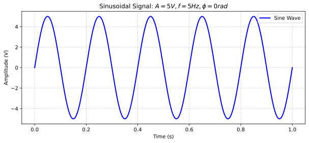

```python
import numpy as np
import matplotlib.pyplot as plt

# Set format to SVG
%config InlineBackend.figure_format = 'svg'

# Best practice: Use a magic command to ensure plots render inline (older notebooks)
%matplotlib inline

# Step 1: Defining the independent variable
t = np.linspace(0, 1, 1000)

# Step 2: Defining the parameters of sine wave
A = 5   # Amplitude
f = 5   # Frequency (Hz)
ph = 0  # Phase (radians)

# Step 3: Expression of sine wave
# Using the formula: x(t) = A * sin(2 * pi * f * t + phase)
x = A * np.sin(2 * np.pi * f * t + ph)

# Step 4: Plotting the sine wave
plt.figure(figsize=(10, 4)) # Optional: Set a wider figure size for better visibility
plt.plot(t, x, color='blue', linewidth=2, label='Sine Wave')

# Styling
plt.xlabel('Time (s)')
plt.ylabel('Amplitude (V)')
plt.grid(True, which='both', linestyle='--', alpha=0.6) # Adds a background grid
plt.legend()

# Title using f-string and LaTeX math rendering
plt.title(fr'Sinusoidal Signal: $A={A}V, f={f}Hz, \phi={ph} rad$')

plt.show()
```


    

    


```python

```
